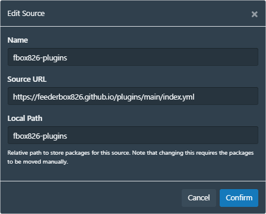

# feederbox826-plugins

Index URL: `https://feederbox826.github.io/plugins/main/index.yml`



# Plugins
avg-rating
- adds average rating to (studios, performers, movies) in %

deleteFP
- adds a button to delete fingerprints

edit-unorganized
- Jumps to a chosen tab when an unorganized (or organized) scene is opened

markergen
- generate markers once they've been saved

rebrand
- add a custom name instead of "Stash" to identify your instance(s)

skip-intro
- skips intros of studios in the [database](https://github.com/feederbox826/stash-skip-intro)

stash-omnisearch
- fork of [stash-omnisearch](https://github.com/hozaywut/stash-omnisearch) for v24+
- Licenced ISC

stash-open
- plugin component of [StashOpen](https://github.com/feederbox826/StashOpen) to allow for local video playback

stashdb-fullimg
- Adds full-size image download from StashDB

studio-img-bg
- Add drop shadows to studio logos

tag-filter
- Marks tags as "Meta-Tags"
- Filters out tags from select menus

tag-graph-js
- Tag graph visualization with d3.js
- [stg-annon/tagGraph](https://github.com/stg-annon/StashScripts/tree/main/plugins/tagGraph) is recommended in lieu of this plugin

tag-video
- support `<videos>` in tags, useful for having large walls of animated tags (Animated GIFs are not optimized)

tagger-img-res
- adds resolution indicators to tagger view

watched-video
- adds badge and css class to watched videos

vjs-shortcut
- Adds (most) [YouTube](https://support.google.com/youtube/answer/7631406) keyboard shortcuts to VideoJS

# Dependency plugins
0gql-intercept
- adds window.fbox826 instance for
  - GQL filtering (incoming requests)
  - GQL events

fontawesome-js
- adds support for `<i>` style fontawesome icons with vanilla JS

forbiddenConfig
- dependency for pulling plugin settings (and more) through Apollo cache
  - ```js
    const settingValue = forbiddenConfig.getPluginSetting("plugin-name", "setting-name", "fallback")
    ```

stashdb-api
- stashdb fetch client set up with ApiKey pre-loaded

titleobserver
- adds an event listener for title changes

wfke
- runs a function when a element matching `document.querySelector()` is found