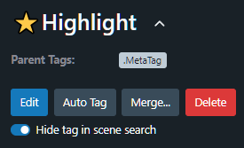
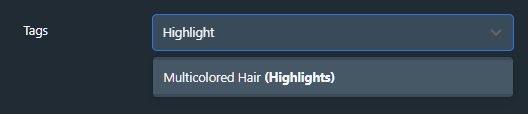

# tag-filter
Addresses [stashapp/stash#2633](https://github.com/stashapp/stash/issues/2633)

Hidden tags are kept locally in browser

Hide selected tags from
  - Scene tag dropdowns
  - Scraper automatic searching

Does **not** hide tag from
  - Filter search
  - `/tags` searchbox
  - backend GQL
  - Scenes with the tag
  - Parent/ subtag menus

## Toggling the hidden tag

